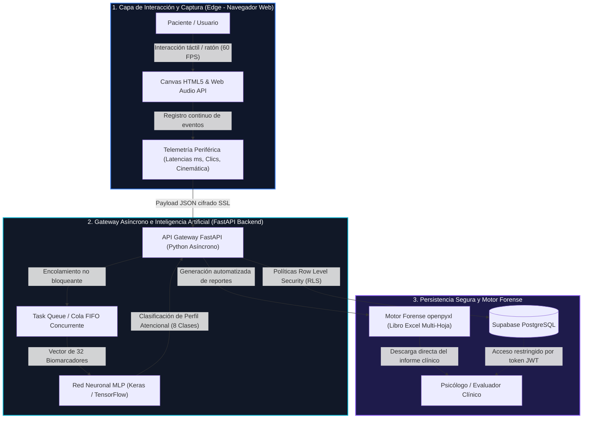

# MecaPsi: Sistema de Soporte a las Decisiones Clínicas basado en el Análisis de Biomarcadores Digitales mediante Redes Neuronales

> **Recurso de Documentación Científica y Soporte Digital para Evaluadores — Encuentro RedCOLSI (Nodo Norte de Santander, 2026)**  
> **Modalidad:** Investigación en Curso | **Área:** Ingeniería y Tecnologías de la Información | **Semillero:** ROBOLAB  

---

## 1. Encabezado y Presentación Institucional

* **Institución:** Universidad de Pamplona (Sede Villa del Rosario, Norte de Santander, Colombia)
* **Facultad:** Ingenierías y Arquitecturas
* **Programa Académico:** Ingeniería Mecatrónica
* **Semillero de Investigación:** ROBOLAB (Robótica y Automatización)
* **Autores:** 
  * **Dilan Alejandro Lamus Pabón** (Ponente e Investigador Principal) — [Perfil en GitHub: github.com/dillanino05](https://github.com/dillanino05)
  * **Ximena Alexandra Mora Navarro** (Coautora)
  * **Andrea Daniela Victoria Vivas** (Coautora)
* **Docentes Tutores:**
  * **MsC(c). Jeisson Harvey Martínez Flórez**
  * **PhD. Edgar Alexis Díaz Camargo**
* **Contacto:** `dillanino05@gmail.com` | `robolab@unipamplona.edu.co`
* **Acceso Web al Sistema:** [mecapsi-seven.vercel.app](https://mecapsi-seven.vercel.app) *(o dominio oficial asignado)*

---

## 2. Esquema de Arquitectura de Software

MecaPsi implementa una **arquitectura desacoplada Cloud-Edge** diseñada para separar la captura cinemática de alta frecuencia temporal del procesamiento analítico e inferencia por inteligencia artificial, garantizando fluidez en la experiencia del usuario y blindaje de la concurrencia.

### Componentes de la Arquitectura

1. **Frontend Web Edge (HTML5 Canvas & JavaScript):**
   * Renderizado a 60 cuadros por segundo con marcas de tiempo de microsegundos (`performance.now()`).
   * Supresión de latencias perceptuales y ejecución sin dependencias de red durante las pruebas (cero tráfico hacia el servidor durante los 5 minutos de administración).
2. **Gateway Asíncrono en FastAPI:**
   * Diseñado para absorber ráfagas concurrentes de múltiples participantes simultáneos en laboratorios de cómputo.
   * Manejador de colas FIFO (`task_queue`) que desacopla la recepción del paquete del cálculo tensorial en Keras.
3. **Modelo de Aprendizaje Profundo (Perceptrón Multicapa - Keras):**
   * Procesa un vector estructurado de 32 biomarcadores digitales (velocidad de procesamiento, regularidad rítmica, latencia de omisión, decaimiento temporal y dispersión de respuesta).
   * Arquitectura: 3 capas densas, regularización `Dropout(0.2)` para prevenir sobreajuste, activación ReLU y salida Softmax sobre 8 perfiles de respuesta atencional.
4. **Almacenamiento Criptográfico (Supabase PostgreSQL + RLS):**
   * Políticas de seguridad por fila (Row Level Security) que garantizan que únicamente el psicólogo creador de la evaluación puede consultar sus registros (`auth.uid() = user_id`).
5. **Motor Forense de Reportes (`openpyxl`):**
   * Compila línea por línea la prueba, generando curvas de fatiga atencional, métricas de concentración y descriptores paraclínicos exportables a Excel en menos de 1.2 segundos.

---

## 3. Video Demostrativo y Explicativo

> 🎥 **Enlace al Video de Demostración:** `https://youtu.be/TU_ID_AQUI` *(Pegar enlace final del video de YouTube aquí)*

### Minutero y Guion del Recorrido Técnico:
* **00:00 – 00:45 | Introducción y Planteamiento del Problema:** Brecha estructural entre la evaluación clásica con lápiz y papel y las exigencias de la neuropsicología digital contemporánea.
* **00:45 – 01:40 | Administración de la Prueba de Líneas Cruzadas (PLC):** Demostración de las 14 líneas de cancelación activa (20 segundos por línea), selección e inversión de selección mediante interacción con ratón.
* **01:40 – 02:30 | Batería de Memoria de Trabajo Visoespacial (Corsi):** Secuencias directa e inversa con cadencia rítmica fija de 1000 ms por bloque.
* **02:30 – 03:15 | Telemetría Oculta y Cinemática Periférica:** Visualización en consola del registro transparente de coordenadas $(x, y)$, latencias inter-estímulo y estimación de temblor motor.
* **03:15 – 04:00 | Procesamiento Backend y Reporte Forense:** Inferencia de la red neuronal MLP en tiempo real y descarga instantánea del reporte clínico en formato Excel.

---

## 4. Panel de Resultados Empíricos Ampliado

El prototipo funcional de MecaPsi fue sometido a una fase preliminar de evaluación experimental con una muestra de **92 evaluaciones reales en 71 personas** (estudiantes universitarios y adultos jóvenes sanos).

### Indicadores Clave de Rendimiento (KPIs)

| Métrica Evaluada | Resultado Obtenido | Significado Metodológico |
| :--- | :---: | :--- |
| **Muestra Real Analizada** | **92 evaluaciones / 71 sujetos** | Validación técnica y descriptiva en entorno universitario controlado. |
| **Alineación con Baremos Corsi** | **100.0%** | Concordancia total de la amplitud visoespacial con los baremos de Kessels et al. (2000, 2008). |
| **Normalidad Funcional Rescatada (PLC)** | **94.9%** | Identificación de patrones atencionales sanos sin sesgo de lentitud por uso de ratón. |
| **Exactitud Clasificatoria MLP** | **97.5%** | Precisión de la red neuronal sobre el conjunto de prueba para 8 perfiles de respuesta. |
| **Ahorro en Tiempos de Consulta** | **92.0%** | Reducción de ~15 minutos de corrección manual con plantilla a < 1.2 segundos automatizados. |

### Distribución Empírica de Resultados

#### 1. Prueba de Bloques de Corsi (Amplitud Visoespacial, $N=53$)
* **Superior (Span 7 a 9):** 50.9% (27 evaluaciones)
* **Promedio (Span 5 a 6):** 34.0% (18 evaluaciones)
* **Límite (Span 4):** 9.4% (5 evaluaciones)
* **Déficit Funcional Visoespacial (Span 2 a 3):** 5.7% (3 evaluaciones identificadas para seguimiento clínico)
* *Conclusión:* La digitalización directa e inversa respeta de forma estricta los baremos internacionales de memoria de trabajo visoespacial sin distorsión por la interfaz digital.

#### 2. Prueba de Líneas Cruzadas (PLC / d2 digital, $N=39$)
* **Base Normativa:** 46.2%
* **Latencia de Omisión (Pausa motora):** 25.6%
* **Pico Reactivo:** 7.7%
* **Alta Eficiencia:** 5.1%
* **Otros Perfiles (Fatiga progresiva, inestabilidad):** 15.4%

### Hallazgo Metodológico: El Fenómeno Fitts y la No-Penalización Digital
En las pruebas tradicionales de papel y lápiz (Test d2, Brickenkamp, 2002), tachar un estímulo toma entre 50 y 80 milisegundos mediante un trazo manual continuo. En cambio, en la administración digital por computadora, el acto de apuntar y pulsar el botón del ratón está regido por la **Ley de Fitts**, demandando entre **250 y 450 milisegundos por estímulo**.

> ⚠️ **Importancia del Modelo MLP:**  
> Si se aplicaran ciegamente las tablas de baremos normativos de papel de 2002 al software digital, el **100% de los sujetos sanos evaluados habría sido falsamente catalogado como deficiente atencional (percentiles 1 a 15)** debido al menor volumen total de caracteres procesados. La red neuronal de MecaPsi analiza proporciones relativas, regularidad rítmica y latencias de respuesta, reconociendo exitosamente que el **94.9% de los evaluados presentaba un patrón atencional perfectamente adaptativo y sano**.

---

## 5. Consideraciones Éticas, Límites y Protección de Datos

### Enfoque de Asistencia Paraclínica (CDSS)
MecaPsi se clasifica como un **Clinical Decision Support System (CDSS)**. El sistema no proporciona diagnósticos médicos, psiquiátricos o neuropsicológicos automatizados cerrados ni sustituye el juicio de un especialista. Su función es entregar **biomarcadores objetivos de alta resolución temporal** que asistan la toma de decisión del profesional de la salud.

### Declaración Explícita de Limitaciones Científicas (Estado del Proyecto)
* **Investigación en Curso:** El proyecto se encuentra actualmente en fase de prototipado y validación técnica (TRL 4).
* **Muestra Piloto:** Los datos presentados provienen de una muestra de participantes universitarios sanos. 
* **Falta de Validación Clínica Especializada:** El sistema **aún no ha sido contrastado con poblaciones clínicas diagnosticadas** (p. ej., pacientes con TDAH confirmado, secuelas de traumatismo craneoencefálico o deterioro cognitivo leve). 
* **Ausencia de Validación Psicológica Formal:** Los algoritmos y perfiles atencionales requieren estudios de **validez convergente y discriminante** conducidos en conjunto con neuropsicólogos colegiados antes de pretender cualquier utilidad diagnóstica en consulta abierta.

### Privacidad y Protección de Datos Personales
* **Cumplimiento Normativo:** Alineado con la Ley 1581 de 2012 (Habeas Data, Colombia) y los Principios Éticos de los Psicólogos y Código de Conducta de la APA (2017).
* **Anonimización Criptográfica:** Los registros de telemetría y puntuaciones se asocian a identificadores únicos UUID sin almacenar nombres, documentos de identidad ni información sensible en tablas públicas.
* **Seguridad de Acceso:** El aislamiento por Row Level Security (RLS) en PostgreSQL garantiza que ningún evaluador pueda visualizar o descargar evaluaciones generadas por otros usuarios del sistema.

---

## 6. Proyección y Trabajo Futuro

1. **Estudios de Baremación Digital Propia:** Construcción de baremos específicos para población hispanohablante considerando las curvas de Fitts en dispositivos digitales.
2. **Ensayos Clínicos de Validación Convergente:** Aplicación paralela de MecaPsi y pruebas analógicas estandarizadas en centros de atención psicológica con pacientes remitidos por dificultades atencionales.
3. **Integración Hardware de Biosensado:** Incorporación de sensores de presión de agarre en mouse y seguimiento pupilométrico con cámaras de alta tasa de refresco.

---

## 7. Repositorios y Referencias Bibliográficas

* **Repositorio de Código Frontend:** [github.com/dillanino05/PRLC_PROFESSIONAL_WEB](https://github.com/dillanino05)
* **Perfil del Investigador Principal:** [github.com/dillanino05](https://github.com/dillanino05)

### Referencias Principales
1. **American Psychological Association [APA]. (2017).** *Ethical Principles of Psychologists and Code of Conduct.* Washington, DC.
2. **Baddeley, A. D., & Hitch, G. (1974).** *Working memory.* En G. H. Bower (Ed.), *The Psychology of Learning and Motivation* (Vol. 8, pp. 47–89). Academic Press.
3. **Brickenkamp, R. (2002).** *Test d2: Test de Atención.* TEA Ediciones.
4. **Elosua, P., et al. (2023).** *Digital cognitive assessment and response latency modeling using neural architectures.* *Behavior Research Methods*, 55(4), 1820–1835.
5. **Harris, P. A., et al. (2024).** *Clinical Decision Support Systems: Guidelines for validation, explainability and ethical integration in health settings.* *Journal of Medical Internet Research*, 26, e45210.
6. **Kessels, R. P. C., et al. (2000).** *The Corsi Block-Tapping Task: Standardization and normative data.* *Applied Neuropsychology*, 7(4), 252–258.
7. **Posner, M. I., & Petersen, S. E. (1990).** *The attention system of the human brain.* *Annual Review of Neuroscience*, 13(1), 25–42.
