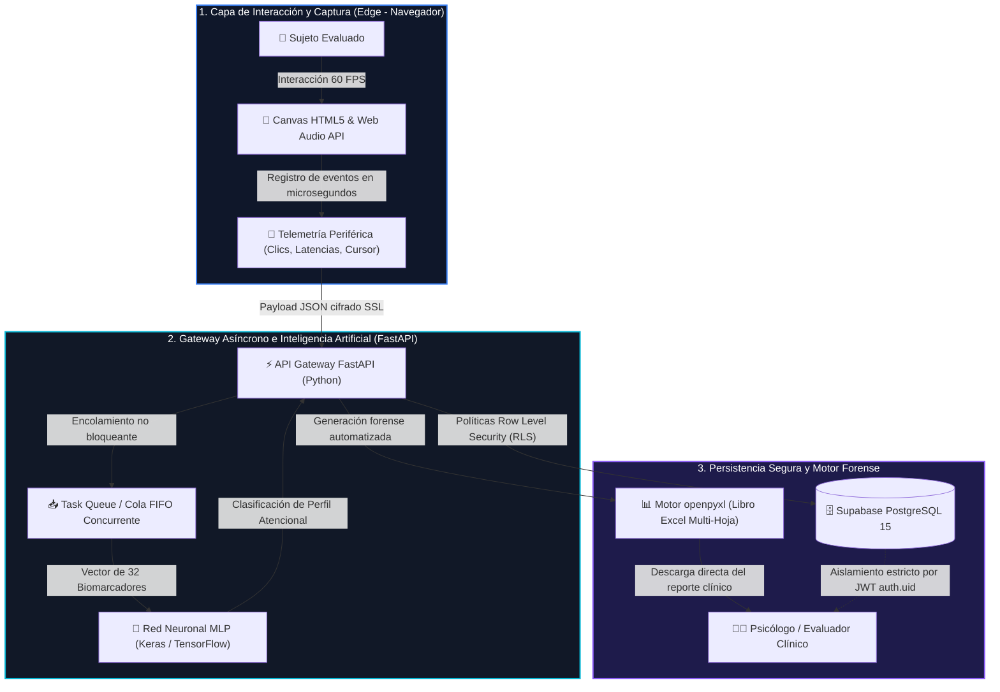

<div align="center">

# 🧠 MecaPsi: Sistema de Soporte a las Decisiones Clínicas (CDSS)
### Basado en el Análisis de Biomarcadores Digitales mediante Redes Neuronales

[](https://mecapsi-seven.vercel.app)
[](https://mecapsi-seven.vercel.app/documentacion)
[](https://dalamus2405-plc-backend.hf.space/docs)
[](https://python.org)
[](https://keras.io)
[](https://supabase.com)
[](https://github.com/dillanino05-create)

<p align="center">
  <b>Plataforma web desacoplada para la evaluación psicométrica de alta resolución temporal, telemetría neuromuscular periférica a 60 FPS y clasificación inteligente de patrones de respuesta atencional.</b>
</p>

[🌐 Probar Aplicación](https://mecapsi-seven.vercel.app) • [📖 Portal de Documentación](https://mecapsi-seven.vercel.app/documentacion) • [📊 Documento RedCOLSI](DOCUMENTACION_REDCOLSI.md) • [🤖 API Docs](https://dalamus2405-plc-backend.hf.space/docs)

</div>

---

## 📌 Tabla de Contenidos
- [1. ¿Qué es MecaPsi?](#-1-qué-es-mecapsi)
- [2. Problemática: Papel y Lápiz vs. Telemetría Digital](#-2-problemática-papel-y-lápiz-vs-telemetría-digital)
- [3. Baterías Neuropsicológicas Digitalizadas](#-3-baterías-neuropsicológicas-digitalizadas)
- [4. Arquitectura de Software y Pipeline de Datos](#-4-arquitectura-de-software-y-pipeline-de-datos)
- [5. El Modelo de Inteligencia Artificial (Keras MLP)](#-5-el-modelo-de-inteligencia-artificial-keras-mlp)
- [6. Hallazgo Metodológico: La Ley de Fitts y el Efecto Interfaz](#-6-hallazgo-metodológico-la-ley-de-fitts-y-el-efecto-interfaz)
- [7. Resultados Empíricos en Muestra Real (N=92 / 71 Sujetos)](#-7-resultados-empíricos-en-muestra-real-n92--71-sujetos)
- [8. Demostración en Video del Sistema](#-8-demostración-en-video-del-sistema)
- [9. Stack Tecnológico](#-9-stack-tecnológico)
- [10. Estructura del Repositorio](#-10-estructura-del-repositorio)
- [11. Instalación y Ejecución Local](#-11-instalación-y-ejecución-local)
- [12. Consideraciones Éticas y Declaración de Madurez (TRL 4)](#-12-consideraciones-éticas-y-declaración-de-madurez-trl-4)
- [13. Autores e Información Institucional](#-13-autores-e-información-institucional)

---

## 💡 1. ¿Qué es MecaPsi?

**MecaPsi** es un **Sistema de Soporte a las Decisiones Clínicas (CDSS - *Clinical Decision Support System*)** diseñado para modernizar y digitalizar la evaluación neuropsicológica de las funciones ejecutivas (atención sostenida, control inhibitorio y memoria de trabajo visoespacial).

Mediante tecnología **HTML5 Canvas a 60 FPS**, telemetría de interacción periférica y modelos de **Deep Learning (Perceptrón Multicapa en Keras)**, el sistema captura y procesa micro-latencias de respuesta, velocidad del cursor y variabilidad rítmica en tiempo real, transformando cada sesión en un **vector de 32 biomarcadores digitales objetivos**.

> ℹ️ **Enfoque de Asistencia Paraclínica:** MecaPsi no busca reemplazar al especialista ni emitir diagnósticos automatizados cerrados; su objetivo es entregar un perfil descriptivo cuantitativo y libre de sesgo motor que potencie el juicio clínico del profesional de la salud.

---

## ⚖️ 2. Problemática: Papel y Lápiz vs. Telemetría Digital

| Dimensión de Evaluación | Método Tradicional (Papel y Lápiz) | MecaPsi (Telemetría Digital Cloud-Edge) |
| :--- | :--- | :--- |
| **Resolución Temporal** | Estática (una sola medición global al terminar). | **Continua a 60 FPS** (marcas de tiempo en microsegundos vía `performance.now()`). |
| **Dinámica de Fatiga** | Invisible al ojo del evaluador. | **Detección de fatiga línea por línea** y curvas de decaimiento rítmico. |
| **Tiempo de Calificación** | Manual (~15 minutos por prueba con plantillas de acetato). | **< 1.2 segundos** (generación automatizada de libro Excel multi-hoja con `openpyxl`). |
| **Sesgo Motor / Interfaz** | No contempla la penalización física del uso del ratón. | **Compensación por Red Neuronal**, evitando falsos positivos por lentitud de interfaz. |
| **Registro de Errores** | Propenso a errores humanos de conteo en la hoja física. | **Auditoría forense al 100% de clics**, coordenadas $(x, y)$ y latencias inter-estímulo. |

---

## 🧪 3. Baterías Neuropsicológicas Digitalizadas

### 1. Prueba de Líneas Cruzadas (PLC / d2 digital)
* **Paradigma:** Tarea de cancelación visual continua basada en el Test d2 de Rolf Brickenkamp.
* **Estructura:** 14 líneas sucesivas de estímulos distractores y objetivos con una ventana temporal fija de **20 segundos por línea**.
* **Interacción:** Selección e inversión de selección interactiva mediante ratón o panel táctil.
* **Métricas Principales:** Total de Elementos Atendidos ($TA$), Errores de Omisión ($O$), Errores de Comisión ($C$), Concentración Neta ($CON = TA - (O + C)$) e Índice de Variabilidad ($VAR = TR_{max} - TR_{min}$).

### 2. Batería de Bloques de Corsi (Memoria Visoespacial)
* **Paradigma:** Tarea de amplitud visoespacial basada en Kessels et al. (2000, 2008).
* **Estructura:** Cubos interactivos en pantalla con estímulos luminosos a cadencia estricta de **1000 ms por bloque**.
* **Modalidades:** 
  * **Corsi Directo:** Retención pasiva y reproducción serial en el mismo orden.
  * **Corsi Inverso:** Manipulación mental ejecutiva en el bucle visoespacial en orden inverso.
* **Métricas Principales:** Span visoespacial máximo, puntuación total de bloques recordados y tiempo de vacilación motora previa al primer clic.

---

## 🏛️ 4. Arquitectura de Software y Pipeline de Datos

El sistema implementa una **arquitectura desacoplada Cloud-Edge** para asegurar que la interacción del paciente se ejecute a 60 FPS en el cliente sin depender del ancho de banda de la red:



---

## 🤖 5. El Modelo de Inteligencia Artificial (Keras MLP)

El módulo de IA no realiza predicciones ciegas ni opera como una "caja negra". Procesa un vector estructurado de **32 biomarcadores numéricos normalizados** mediante `StandardScaler`:

* **Arquitectura:** Red Neuronal Perceptrón Multicapa (MLP) supervisada.
  * Capa de Entrada: 32 características biométricas.
  * Capas Ocultas: 3 capas densas con activación `ReLU` y regularización `Dropout(0.2)` para evitar sobreajuste.
  * Capa de Salida: Capa densa con activación `Softmax` sobre 8 perfiles de respuesta.
* **Exactitud Técnica:** **97.5%** de exactitud sobre el conjunto de prueba sintético estructurado de 14.000 registros.
* **Perfiles Clasificados:** 
  1. `Base_Normativa` (Ritmo adaptativo, balance velocidad-precisión).
  2. `Latencia_Omision` (Estilo cauteloso/pausado con costo temporal por discriminación).
  3. `Pico_Reactivo` (Aceleraciones impulsivas iniciales con decremento posterior).
  4. `Alta_Eficiencia` (Excelente velocidad psicomotora con mínima tasa de error).
  5. `Fatiga_Progresiva` (Decaimiento atencional sostenido hacia las últimas líneas).
  6. `Inestabilidad_Atencional` (Alta varianza inter-línea en tiempos de respuesta).
  7. `Sobrecompensacion_Inversa` (Inicio cauteloso y aceleración terminal compensatoria).
  8. `Falsa_Activacion_Motora` (Patrón atípico de pulsaciones periféricas).

---

## ⚡ 6. Hallazgo Metodológico: La Ley de Fitts y el Efecto Interfaz

Durante la validación experimental se identificó un fenómeno biomecánico crítico al comparar el formato analógico de papel con la plataforma web:

* En papel (Test d2 clásico), el sujeto tacha estímulos de forma continua a razón de **50 a 80 ms por carácter**.
* En computadora, apuntar y hacer clic con el ratón está determinado por la **Ley de Fitts**:
  $$\text{MT} = a + b \cdot \log_2\left(\frac{2D}{W}\right)$$
  lo que introduce una latencia física y psicomotora inevitable de **250 a 450 ms por estímulo**.

> ⚠️ **El Sesgo de los Baremos Antiguos:**  
> Si se aplicaran ciegamente las tablas normativas de papel de 2002 a la prueba digital, el **100% de los participantes sanos habría sido erróneamente clasificado como deficiente atencional (percentiles 1 al 15)** por el menor volumen de caracteres tachados.  
> La Red Neuronal de MecaPsi analiza patrones de consistencia relativa, variabilidad rítmica y proporción de aciertos, rescatando que el **94.9% de los evaluados presentaba una función atencional completamente sana y adaptativa**.

---

## 📈 7. Resultados Empíricos en Muestra Real (N=92 / 71 Sujetos)

El prototipo fue evaluado de manera preliminar sobre una cohorte de **92 evaluaciones en 71 personas reales** (estudiantes universitarios y adultos sanos):

| Métrica / Dimensión | Resultado Experimental | Interpretación Psicométrica y Clínica |
| :--- | :---: | :--- |
| **Tamaño de Muestra** | **92 evaluaciones / 71 sujetos** | Validación técnica, descriptiva y de usabilidad en entorno universitario. |
| **Alineación Batería Corsi** | **100.0% de concordancia** | Distribución armónica con los baremos normativos clásicos de Kessels et al. (Span medio: 6.26 bloques). |
| **Normalidad Rescatada (PLC)** | **94.9% de la muestra** | El modelo MLP previene la patologización injusta derivada de la latencia del ratón. |
| **Exactitud Clasificatoria MLP** | **97.5% de exactitud** | Alta capacidad de discriminación en los 8 perfiles de respuesta conductual. |
| **Optimización de Consulta** | **92% de ahorro en tiempo** | Reducción del tiempo de tabulación de ~15 minutos a **< 1.2 segundos** con reporte Excel forense. |

---

## 🎥 8. Demostración en Video del Sistema

> 🔗 **Acceso al Video Demostrativo:** [Ver Video en YouTube](https://youtu.be/TU_ID_AQUI) *(Enlace de demostración sin voz mostrando el flujo completo de la plataforma)*

### Momentos Clave del Recorrido:
* `00:00` — Vista general de la Landing Page y bienvenida institucional.
* `00:30` — Inicio de sesión clínico y panel de selección de pruebas.
* `00:50` — Formulario estandarizado de ingreso de datos del evaluado.
* `01:15` — Pantalla de instrucciones y familiarización para el paciente.
* `01:40` — Ejecución real de la Prueba de Líneas Cruzadas (PLC - Cancelación activa a 60 FPS).
* `02:15` — Ejecución de la Batería de Bloques de Corsi (Directo e Inverso).
* `02:45` — Procesamiento en tiempo real y descarga del informe forense en Excel.

---

## 🛠️ 9. Stack Tecnológico

| Capa / Módulo | Tecnologías y Librerías Utilizadas |
| :--- | :--- |
| **Frontend Web** | HTML5 Canvas, JavaScript Vanilla (ES6+), CSS3 Moderno, Web Audio API, Chart.js, Mermaid.js. |
| **Backend API Gateway** | Python 3.10+, FastAPI, Uvicorn, asyncio, Task Queue FIFO. |
| **Inteligencia Artificial** | TensorFlow 2.x, Keras, Scikit-Learn (StandardScaler, Joblib), NumPy, Pandas. |
| **Motor Forense de Reportes** | `openpyxl` (Generación de libros Excel multi-hoja con gráficos vectoriales y auditoría de latencias). |
| **Persistencia y Seguridad** | Supabase (PostgreSQL 15), Row Level Security (RLS), Autenticación JWT Cifrada. |
| **Despliegue y DevOps** | Vercel (Frontend SPA), Hugging Face Spaces (Backend Docker / FastAPI), Git / GitHub. |

---

## 📂 10. Estructura del Repositorio

```bash
PLC_Professional/
├── README.md                           # Documentación principal del repositorio
├── DOCUMENTACION_REDCOLSI.md           # Documento maestro para jurados de RedCOLSI
├── vercel.json                         # Configuración de rutas y rewrites de Vercel
├── Dockerfile                          # Contenedor Docker para Hugging Face Spaces
├── requirements.txt                    # Dependencias de Python para el backend
├── models/
│   ├── d2_mlp_model_v3.keras           # Red Neuronal MLP entrenada (Keras)
│   └── d2_scaler_v3.joblib             # Normalizador StandardScaler de 32 features
├── web/
│   ├── frontend/
│   │   ├── index.html                  # Landing page institucional MecaPsi
│   │   ├── app.html                    # SPA de administración de pruebas
│   │   ├── documentacion.html          # Portal web científico interactivo RedCOLSI
│   │   ├── css/style.css               # Sistema de diseño y temas visuales
│   │   └── js/app.js                   # Lógica de administración, Canvas 60 FPS y telemetría
│   └── backend/
│       ├── main.py                     # API Gateway FastAPI y endpoints analíticos
│       ├── predictor.py                # Pipeline de extracción de 32 biomarcadores e inferencia
│       └── excel_export.py             # Motor forense de reportes openpyxl
└── obsidian_vault/                     # Bóveda de conocimiento interconectada del proyecto
    ├── 00 - INDICE GENERAL DEL SISTEMA.md
    ├── 01 - Arquitectura de Despliegue.md
    ├── 03 - Backend y Modelos de Inteligencia Artificial.md
    └── 13 - Documentacion y Soporte Web RedCOLSI.md
```

---

## 🚀 11. Instalación y Ejecución Local

### Prerrequisitos
* Python 3.10 o superior instalado.
* Git.
* Navegador web moderno (Chrome, Edge, Firefox).

### 1. Clonar el Repositorio
```bash
git clone https://github.com/dillanino05-create/PRLC_PROFESSIONAL_WEB.git
cd PRLC_PROFESSIONAL_WEB
```

### 2. Configurar el Entorno Virtual de Python
```bash
# Crear entorno virtual
python -m venv venv

# Activar entorno virtual
# En Windows (PowerShell):
.\venv\Scripts\Activate.ps1
# En Linux / macOS:
source venv/bin/activate

# Instalar dependencias
pip install -r requirements.txt
```

### 3. Ejecutar el Backend (FastAPI)
```bash
uvicorn web.backend.main:app --host 0.0.0.0 --port 7860 --reload
```
La documentación interactiva de la API estará disponible en `http://localhost:7860/docs`.

### 4. Servir el Frontend
Puedes servir la carpeta `web/frontend` mediante cualquier servidor estático (Live Server de VS Code, o con Python):
```bash
python -m http.server 8000 --directory web/frontend
```
Abre en tu navegador: `http://localhost:8000/index.html` o `http://localhost:8000/documentacion.html`.

---

## 🛡️ 12. Consideraciones Éticas y Declaración de Madurez (TRL 4)

* **Naturaleza Asistencial (CDSS):** MecaPsi está catalogado como un Sistema de Soporte a las Decisiones Clínicas. Sus algoritmos están concebidos para proporcionar descriptores objetivos paraclínicos al especialista evaluador; **en ningún caso emite diagnósticos médicos, psiquiátricos ni clínicos automatizados**.
* **Estado de la Investigación:** Proyecto clasificado en modalidad de **Investigación en Curso** (Nivel de Madurez Tecnológica TRL 4 - Prototipo validado en laboratorio).
* **Límites de la Muestra Actual:** Las 92 evaluaciones corresponden a una muestra de validación técnica y descriptiva en estudiantes universitarios y adultos sanos. **Se declara explícitamente que el sistema aún no cuenta con validación clínica convergente en poblaciones patológicas** (p. ej., pacientes con TDAH confirmado o deterioro cognitivo leve).
* **Validación Colegiada Futura:** La validación formal con neuropsicólogos colegiados y ensayos clínicos controlados constituye el trabajo futuro prioritario del proyecto.
* **Privacidad y Habeas Data:** Cumplimiento riguroso de la Ley 1581 de 2012 (Colombia) y el Código Ético de la APA. Los registros de telemetría se almacenan anonimizados bajo identificadores hash, blindados mediante políticas de Row Level Security (RLS).

---

## 👥 13. Autores e Información Institucional

* **Institución:** Universidad de Pamplona — Sede Villa del Rosario, Norte de Santander, Colombia.
* **Facultad:** Facultad de Ingenierías y Arquitecturas.
* **Programa Académico:** Ingeniería Mecatrónica.
* **Semillero de Investigación:** ROBOLAB (Robótica y Automatización).
* **Evento Académico:** Encuentro Departamental de Semilleros de Investigación — **RedCOLSI** (Nodo Norte de Santander, 2026).

### Equipo de Investigación
* **Dilan Alejandro Lamus Pabón** — *Investigador Principal y Desarrollador Líder*  
  GitHub: [@dillanino05-create](https://github.com/dillanino05-create) | Email: `dillanino05@gmail.com`
* **Ximena Alexandra Mora Navarro** — *Coautora e Investigadora*
* **Andrea Daniela Victoria Vivas** — *Coautora e Investigadora*

### Docentes Tutores
* **MsC(c). Jeisson Harvey Martínez Flórez** — *Tutor de Investigación*
* **PhD. Edgar Alexis Díaz Camargo** — *Director de Investigación*

---

<div align="center">
  <sub>Desarrollado con rigor científico y pasión por la ingeniería biomédica y la mecatrónica en el semillero ROBOLAB &bull; Universidad de Pamplona &bull; 2026</sub>
</div>
