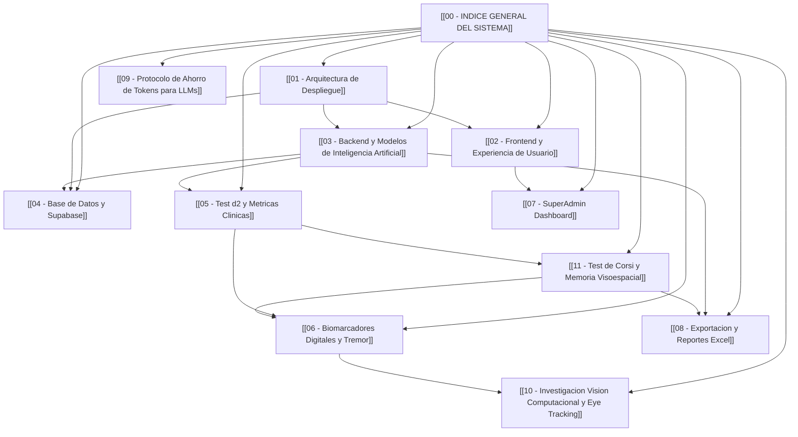

# 🧠 PLC Professional (MecaPsi) — Índice General del Sistema

Bienvenido a la base de conocimiento interconectada de **PLC Professional** (v3.2).
Esta bóveda está diseñada tanto para navegación visual en **Obsidian** (Graph View) como para **lectura rápida y optimizada por agentes de IA** (Claude, Gemini) para evitar consumos innecesarios de tokens.

---

## 🗺️ Mapa de Navegación del Sistema (MOC)

---

## 📌 Documentos Clave

1. 🌐 **[[01 - Arquitectura de Despliegue]]**:
   Separación exacta entre **GitHub**, **Vercel** (Frontend), **Hugging Face Spaces** (Backend + IA Keras) y **Supabase** (Base de Datos + Auth).

2. 💻 **[[02 - Frontend y Experiencia de Usuario]]**:
   Estructura de la SPA en JavaScript Vanilla (`web/frontend/js/app.js`), estilos (`style.css`), ciclo de vida y navegación entre pantallas.

3. 🤖 **[[03 - Backend y Modelos de Inteligencia Artificial]]**:
   API FastAPI en `web/backend/main.py`, modelo MLP Keras (`d2_mlp_model_v3.keras`), normalizador (`d2_scaler_v3.joblib`), y perfiles cognitivos predichos.

4. 🗄️ **[[04 - Base de Datos y Supabase]]**:
   Tablas de la base de datos (`evaluations`), políticas RLS de aislamiento entre psicólogos y credencial maestra `service_role` para SuperAdmin.

5. ⏱️ **[[05 - Test d2 y Metricas Clinicas]]**:
   Lógica psicométrica del test d2 (14 páginas × 47 estímulos × 20 segundos), cálculo de TA, O, COM, CON, CP, TRM, VAR, etc.

6. 🖱️ **[[06 - Biomarcadores Digitales y Tremor]]**:
   Muestreo cinemático a 60fps del cursor `{x, y, t}`, cálculo de jitter, aceleraciones instantáneas y umbral clínico de temblor motor.

7. 🛡️ **[[07 - SuperAdmin Dashboard]]**:
   Consola exclusiva de Dilan para auditar todas las cuentas de psicólogos, volumen de evaluaciones globales, métricas y gráficas sin RLS.

8. 📊 **[[08 - Exportacion y Reportes Excel]]**:
   Motor `openpyxl` en `web/backend/excel_export.py` que compila el reporte clínico profesional en 5 hojas de cálculo con gráficos y alertas.

9. ⚡ **[[09 - Protocolo de Ahorro de Tokens para LLMs]]**:
   Reglas de consulta económica para modelos LLM (Claude/Gemini): qué leer primero y cómo evitar escanear archivos gigantes.

10. 👁️ **[[10 - Investigacion Vision Computacional y Eye Tracking]]**:
    Módulo de R&D para Eye Tracking en webcam (MediaPipe Iris) y Facial Emotion Recognition (FER) a 3Hz, correlacionados con eventos del test PLC.

11. 🧊 **[[11 - Test de Corsi y Memoria Visoespacial]]**:
    Batería neuropsicológica de bloques de Corsi (Directo e Inverso), Span visoespacial, duda previa (ms), telemetría neuromuscular compartida y reporte forense Excel.

---
*Versión de la plataforma: **v3.3 (Corsi + PLC Multi-Battery)** · Actualizado: **Septiembre 2026** · Diseñado para Obsidian Graph View*
