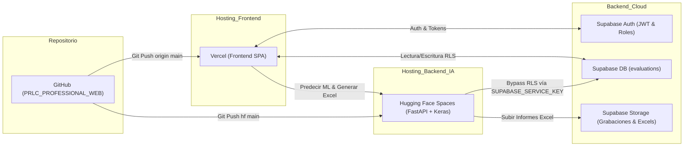

# 🌐 01 - Arquitectura de Despliegue

La plataforma **PLC Professional** opera bajo una arquitectura desacoplada moderna, dividiendo responsabilidades entre el cliente web (Frontend), el motor analítico de IA (Backend), la persistencia/autenticación en la nube (Supabase) y el control de versiones (GitHub).

---

## 🏗️ Mapa de Componentes y Flujo de Datos



---

## 🧩 Detalle por Plataforma

### 1. GitHub (`dillanino05-create/PRLC_PROFESSIONAL_WEB`)

- **Rol:** Repositorio central y fuente única de verdad.
- **Ramas:** `main` (producción).
- **Integración continua:** Cualquier push activa automáticamente el despliegue de **Vercel**.

### 2. Vercel (Frontend Web)

- **Rol:** Servidor perimetral (Edge CDN) que sirve la interfaz visual a usuarios de todo el mundo con latencia mínima.
- **Archivos servidos:** `web/frontend/` (`index.html`, `app.js`, `metrics.js`, `style.css`).
- **Conexión API:** Detecta automáticamente si está en local (`localhost`) o en producción para apuntar sus peticiones a:

  ```javascript
  const API_BASE = window.location.hostname === 'localhost' || window.location.hostname === '127.0.0.1'
    ? ''
    : 'https://dalamus2405-plc-backend.hf.space';
  ```

### 3. Hugging Face Spaces (`Dalamus2405/plc-backend`)

- **Rol:** Servidor de cómputo en la nube basado en Docker (`python:3.10-slim`).
- **Responsabilidades:**
  - Ejecución del modelo de Deep Learning Keras (`d2_mlp_model_v3.keras`).
  - Generación de hojas de cálculo de alta fidelidad clínica con `openpyxl`.
  - Endpoint de administración global `/api/admin/stats` con la Service Role Key.
- **Puerto interno:** `7860`.

### 4. Supabase (`lfyaiwbtfgoiczyyzlwh.supabase.co`)

- **Auth:** Manejo de sesiones, tokens Bearer JWT y asignación de roles en `user_metadata` (`superadmin` vs `psicólogo clínico`).
- **Database (PostgreSQL):** Tabla `evaluations`.
- **Seguridad (RLS):** Cada psicólogo solo puede ver sus propios pacientes. Solo el SuperAdmin con `SUPABASE_SERVICE_KEY` puede auditar todos los registros.

---

## 🔗 Enlaces Relacionados en la Bóveda

- [[00 - INDICE GENERAL DEL SISTEMA]]
- [[02 - Frontend y Experiencia de Usuario]]
- [[03 - Backend y Modelos de Inteligencia Artificial]]
- [[04 - Base de Datos y Supabase]]
- [[07 - SuperAdmin Dashboard]]

