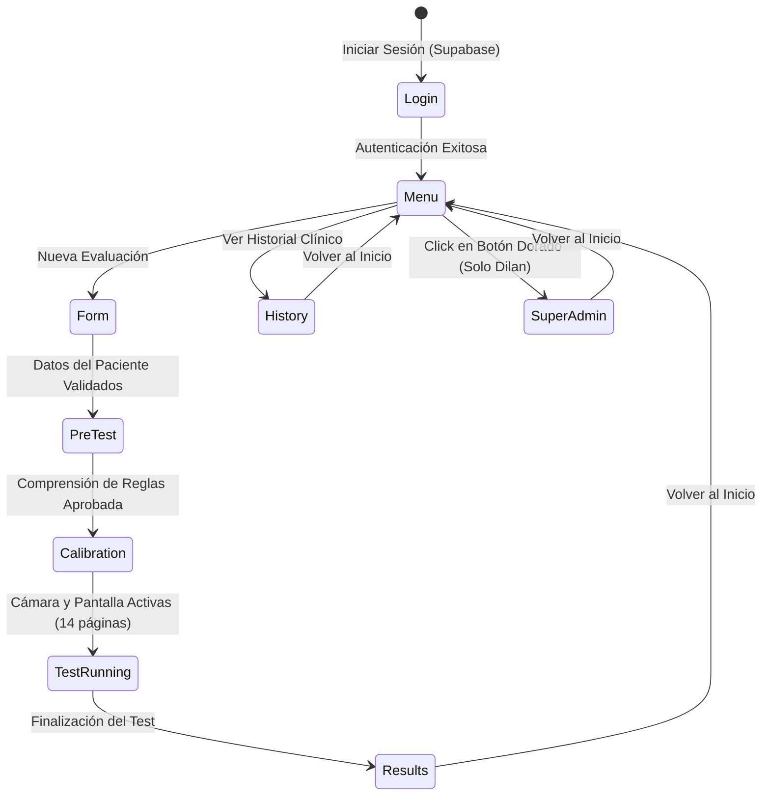

# 💻 02 - Frontend y Experiencia de Usuario

El frontend de **PLC Professional** está construido como una Single Page Application (SPA) en **JavaScript Vanilla**, maximizando la velocidad de respuesta sin la sobrecarga de frameworks pesados.

---

## 🗺️ Mapa de Navegación de Pantallas (`App.screen`)

---

## 📂 Archivos Principales del Frontend

| Archivo | Ubicación | Responsabilidad |
| --- | --- | --- |
| `index.html` | `web/frontend/index.html` | Estructura HTML base, contenedor `#app`, carga de CDNs (Supabase, Chart.js, Confetti). |
| `app.js` | `web/frontend/js/app.js` | Objeto maestro `App`: estado global, router `nav()`, renderers de todas las pantallas, listeners de mouse y cámara. |
| `metrics.js` | `web/frontend/js/metrics.js` | Motor psicométrico puro: `calcMetrics()`, `generateNarrative()`, `computeTremorScore()`. |
| `style.css` | `web/frontend/css/style.css` | Sistema de diseño: variables CSS (paleta índigo/oro), glassmorphism, tipografía Inter, animaciones. |

---

## ⚙️ Características Técnicas Clave

1. **Ciclo del Test d2:**
   - 14 páginas numeradas (1 a 14).
   - 47 caracteres por página (combinaciones de letras `d` y `p` con 1, 2, 3 o 4 líneas o comillas).
   - Temporizador estricto de **20 segundos por página**. Al expirar, pasa automáticamente a la siguiente línea.
   - Detección de saltos erráticos y retrocesos (violación del barrido visual de izquierda a derecha).

2. **Protocolo de Grabación y Permisos Pre-Test:**
   - **Pregunta Previa de Cámara:** Antes de iniciar, el sistema consulta explícitamente al evaluador/paciente si desea activar la cámara web. Si se autoriza, se captura en segundo plano para evitar distracciones visuales; si se declina, se continúa sin cámara.
   - **Compartir Pantalla Obligatorio ("Sí o Sí"):** La captura de pantalla es un requisito obligatorio del protocolo clínico para registrar el barrido visual completo y la resolución de ítems. Si el usuario cancela o deniega el selector del navegador, el sistema bloquea el avance a la práctica, muestra una alerta explicativa y exige reintentar hasta obtener el stream de pantalla.
   - **Mezcla de Streams (PiP / 15 FPS):** Canvas offscreen que combina pantalla y webcam para optimizar consumo de CPU y generar el video WebM consolidado.

3. **Caché y Desconexión:**
   - Si la red falla temporalmente, las evaluaciones se retienen en memoria hasta reintentar la subida.

---

## 🔗 Enlaces Relacionados en la Bóveda

- [[00 - INDICE GENERAL DEL SISTEMA]]
- [[01 - Arquitectura de Despliegue]]
- [[05 - Test d2 y Metricas Clinicas]]
- [[06 - Biomarcadores Digitales y Tremor]]
- [[07 - SuperAdmin Dashboard]]
