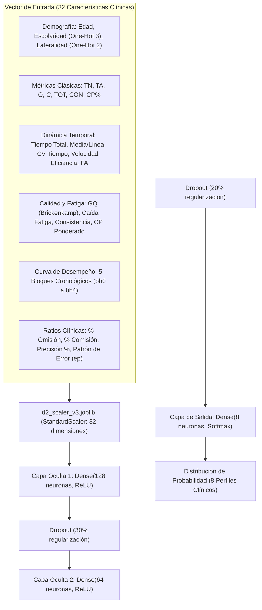

# 🤖 03 - Backend y Modelos de Inteligencia Artificial

El backend de **PLC Professional** está desarrollado en **Python (FastAPI)** y se encarga de las tareas analíticas de alta intensidad: inferencia con redes neuronales profundas (Keras), escalamiento estadístico (Scikit-Learn) y generación de reportes clínicos en Excel.

---

## 🛰️ Endpoints de la API (`web/backend/main.py`)

| Método | Ruta | Autenticación | Función |
| --- | --- | --- | --- |
| `GET` | `/api/status` | Pública | Comprueba disponibilidad del modelo Keras y versión activa (`v3.2`). |
| `POST` | `/api/predict` | Pública / Interna | Ejecuta inferencia sobre el vector de 16 variables psicométricas. |
| `POST` | `/api/evaluations/save` | `Bearer Token` | Guarda la evaluación en Supabase y programa la generación del Excel en background. |
| `GET` | `/api/evaluations/{id}/excel` | `Bearer Token` | Descarga el archivo `.xlsx` profesional compilado para el paciente. |
| `DELETE` | `/api/evaluations/{id}` | `Bearer Token` | Elimina una evaluación de la base de datos (restringido por usuario). |
| `GET` | `/api/admin/stats` | `Bearer Token` + `superadmin` | Retorna métricas globales, psicólogos registrados y evaluaciones históricas sin RLS. |

---

## 🧠 Arquitectura de la Red Neuronal (MLP Keras v3)

El modelo predictivo está serializado en `d2_mlp_model_v3.keras` y pre-entrenado con datos normativos y clínicos del Test d2 adaptados al entorno digital mediante simulación Monte Carlo de la latencia de la Ley de Fitts.

---

### 📐 Formulación Matemática y Flujo Tensorial

1. **Estandarización Z-Score de Entrada:**
   $$\mathbf{z} = \frac{\mathbf{x} - \boldsymbol{\mu}_{\text{scaler}}}{\boldsymbol{\sigma}_{\text{scaler}}}, \quad \mathbf{x} \in \mathbb{R}^{32}$$
   Donde $\boldsymbol{\mu}_{\text{scaler}}, \boldsymbol{\sigma}_{\text{scaler}} \in \mathbb{R}^{32}$ igualan la varianza de variables con magnitudes dispares (milisegundos vs ratios porcentuales).

2. **Propagación Jerárquica No Lineal:**
   $$\mathbf{h}_1 = \text{ReLU}(\mathbf{W}_1 \mathbf{z} + \mathbf{b}_1), \quad \mathbf{W}_1 \in \mathbb{R}^{128 \times 32}, \; \mathbf{b}_1 \in \mathbb{R}^{128}$$
   $$\tilde{\mathbf{h}}_1 = \mathbf{h}_1 \odot \mathbf{m}_1, \quad \mathbf{m}_1 \sim \text{Bernoulli}(1 - 0.3)$$
   $$\mathbf{h}_2 = \text{ReLU}(\mathbf{W}_2 \tilde{\mathbf{h}}_1 + \mathbf{b}_2), \quad \mathbf{W}_2 \in \mathbb{R}^{64 \times 128}, \; \mathbf{b}_2 \in \mathbb{R}^{64}$$
   $$\tilde{\mathbf{h}}_2 = \mathbf{h}_2 \odot \mathbf{m}_2, \quad \mathbf{m}_2 \sim \text{Bernoulli}(1 - 0.2)$$

3. **Inferencia Probabilística (Softmax):**
   $$\hat{y}_i = \frac{e^{(\mathbf{W}_3 \tilde{\mathbf{h}}_2 + \mathbf{b}_3)_i}}{\sum_{j=0}^{7} e^{(\mathbf{W}_3 \tilde{\mathbf{h}}_2 + \mathbf{b}_3)_j}}, \quad i \in \{0, \dots, 7\}$$

---

## 🏷️ Los 8 Perfiles Clínicos Clasificados

| Código | Clave de Perfil | Denominación Neuropsicológica | Criterio de Activación |
|---|---|---|---|
| **0** | `Base_Normativa` | Rendimiento Base Normativo | Aciertos y omisiones dentro de expectativa etaria y rítmica. |
| **1** | `Latencia_Omision` | Latencia de Respuesta con Omisión | Estilo cauteloso/reflexivo: $O \gg C$, velocidad reducida con $C=0$. |
| **2** | `Pico_Reactivo` | Alta Reactividad Específica (Comisión Elevada) | Falla de control inhibitorio: pulsaciones precipitadas con distractores. |
| **3** | `Varianza_Alta` | Varianza Bilateral | Fluctuación interlineal marcada ($VAR > 25$), inconsistencia intra-bloque. |
| **4** | `Desempeno_Decrescente` | Desempeño Decrescente (Fase Final) | Fatiga atencional progresiva: caída aguda de rendimiento en líneas 10 a 14. |
| **5** | `Latencia_Sostenida` | Latencia Larga Sostenida | Bradipsiquia: procesamiento homogéneo pero ralentizado de principio a fin. |
| **6** | `Alta_Eficiencia` | Alta Eficiencia de Rastreo | Desempeño superior: $TA > 130$ con errores mínimos ($O \le 3, C = 0$). |
| **7** | `Latencia_Estricta` | Restricción de Respuesta y Alta Latencia | Hipercautela extrema: mínimo volumen total con 100% de exactitud. |

---

## 🔗 Enlaces Relacionados en la Bóveda

- [[00 - INDICE GENERAL DEL SISTEMA]]
- [[01 - Arquitectura de Despliegue]]
- [[05 - Test d2 y Metricas Clinicas]]
- [[07 - SuperAdmin Dashboard]]
- [[08 - Exportacion y Reportes Excel]]
