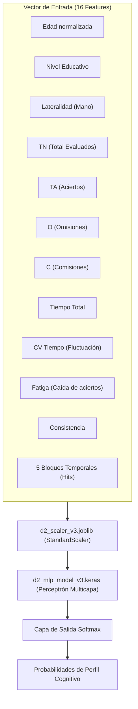

# 🤖 03 - Backend y Modelos de Inteligencia Artificial

El backend de **PLC Professional** está desarrollado en **Python (FastAPI)** y se encarga de las tareas analíticas de alta intensidad: inferencia con redes neuronales profundas (Keras), escalamiento estadístico (Scikit-Learn) y generación de reportes clínicos en Excel.

---

## 🛰️ Endpoints de la API (`web/backend/main.py`)

| Método | Ruta | Autenticación | Función |
|---|---|---|---|
| `GET` | `/api/status` | Pública | Comprueba disponibilidad del modelo Keras y versión activa (`v3.2`). |
| `POST` | `/api/predict` | Pública / Interna | Ejecuta inferencia sobre el vector de 16 variables psicométricas. |
| `POST` | `/api/evaluations/save` | `Bearer Token` | Guarda la evaluación en Supabase y programa la generación del Excel en background. |
| `GET` | `/api/evaluations/{id}/excel` | `Bearer Token` | Descarga el archivo `.xlsx` profesional compilado para el paciente. |
| `DELETE` | `/api/evaluations/{id}` | `Bearer Token` | Elimina una evaluación de la base de datos (restringido por usuario). |
| `GET` | `/api/admin/stats` | `Bearer Token` + `superadmin` | Retorna métricas globales, psicólogos registrados y evaluaciones históricas sin RLS. |

---

## 🧠 Arquitectura de la Red Neuronal (MLP Keras)

El modelo predictivo está serializado en `d2_mlp_model_v3.keras` y pre-entrenado con datos normativos y clínicos del Test d2.

---

## 🏷️ Perfiles Clínicos Clasificados

1. **Control Sano (Rendimiento Óptimo):** Alta concentración (CP > 85%), baja tasa de error y ritmo constante.
2. **TDAH — Subtipo Inatento:** Alta proporción de omisiones frente a comisiones, tiempo de reacción lento o fluctuante.
3. **TDAH — Subtipo Combinado:** Elevadas omisiones y comisiones simultáneas, variabilidad inter-bloque alta.
4. **Perfil Impulsivo / Falla Inhibitoria:** Alta tasa de comisiones (marcado de distractores), velocidad elevada a costa de precisión.
5. **Fatiga Neurocognitiva Severa:** Declive progresivo y marcado del rendimiento entre el primer y segundo bloque del test (TRM negativo agudo).

---

## 🔗 Enlaces Relacionados en la Bóveda
- [[00 - INDICE GENERAL DEL SISTEMA]]
- [[01 - Arquitectura de Despliegue]]
- [[05 - Test d2 y Metricas Clinicas]]
- [[07 - SuperAdmin Dashboard]]
- [[08 - Exportacion y Reportes Excel]]
