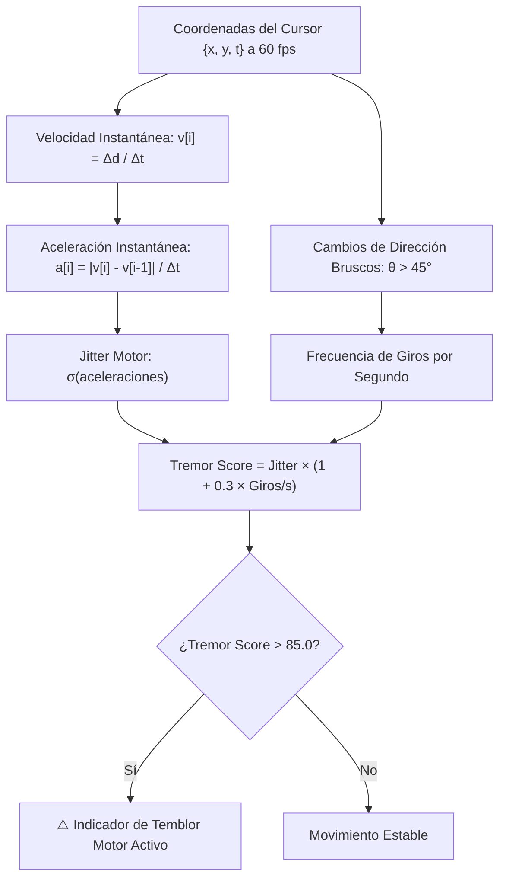

# 🖱️ 06 - Biomarcadores Digitales y Tremor Motor

Una de las innovaciones clave de **PLC Professional** es la extracción de **biomarcadores motores digitales** a partir de la micro-cinemática del cursor durante la ejecución del test.

---

## 🔬 Fundamento Fisiológico y Clínico

En sujetos con **TDAH**, ansiedad clínica, fatiga psicomotora o trastornos neurológicos, los movimientos de la mano reflejan:

1. **Micromovimientos involuntarios de alta frecuencia (Jitter motor):** Temblor fino en la trayectoria del cursor.
2. **Correcciones bruscas de trayectoria:** Cambios angulares repentinos causados por impulsividad o pérdida momentánea del foco de atención.

---

## 📐 Modelo Físico-Matemático (`web/frontend/js/metrics.js`)

Durante cada página de 20 segundos, el navegador captura muestras continuas a $\le 60 \text{ fps}$:
$$\text{Muestra } i = \{x_i, y_i, t_i\}$$

---

## ⚙️ Parámetros Clínicos

- **Umbral Clínico (`TREMOR_THRESHOLD`):** `85.0` (px/s² normalizado).
- **Almacenamiento:**
  - En `lines_data`: cada página almacena su propio `tremor_score` y `tremor_flag`.
  - En `metrics_json`: lista `tremor_lines` con las páginas que dispararon la alerta.
- **Reflejo en Reportes:**
  - **Excel Hoja 1:** Sección especial de biomarcadores motores en el resumen ejecutivo.
  - **Excel Hoja 2:** Columnas dedicadas *"Tremor Score (Jitter Motor)"* y *"⚠️ Indicador Temblor Motor"*.

---

## 🔗 Enlaces Relacionados en la Bóveda

- [[00 - INDICE GENERAL DEL SISTEMA]]
- [[02 - Frontend y Experiencia de Usuario]]
- [[05 - Test d2 y Metricas Clinicas]]
- [[08 - Exportacion y Reportes Excel]]
