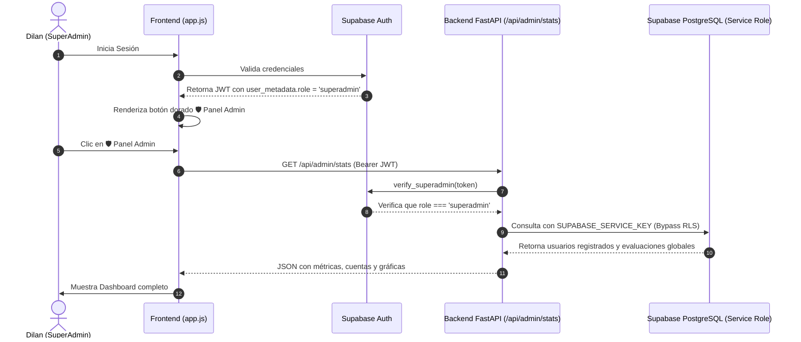

# 🛡️ 07 - SuperAdmin Dashboard

El **Panel de SuperAdmin** es la consola de mando global reservada exclusivamente para el administrador general de la plataforma (**Dilan Alejandro Lamus Pabón**).

---

## 🔒 Arquitectura de Seguridad y Verificación

---

## 📊 Componentes del Dashboard

1. **Tarjetas KPI Principales:**
   - **Total Evaluaciones:** Conteo histórico total de pruebas en toda la plataforma.
   - **Cuentas de Psicólogos:** Total de profesionales clínicos registrados en Supabase Auth.
   - **Evaluaciones Hoy:** Conteo de pruebas del día en curso.
   - **Perfil Más Frecuente:** Diagnóstico IA predominante a nivel poblacional.

2. **Tabla de Cuentas de Psicólogos Registrados:**
   - Correo electrónico.
   - Rol de acceso (`SuperAdmin` con badge dorado o `Psicólogo Clínico`).
   - Cantidad de evaluaciones realizadas por esa cuenta.
   - Fecha de registro y último acceso.

3. **Gráficos Estadísticos (Chart.js):**
   - **Gráfico de Barras:** Evolución del volumen de evaluaciones por fecha (histórico completo).
   - **Gráfico de Dona:** Distribución porcentual de los perfiles predichos por la IA (Control Sano, TDAH, Impulsivo, etc.).

4. **Tabla de Evaluaciones Clínicas Globales:**
   - Historial de hasta 50 evaluaciones recientes con scroll interno, ID del participante, edad, diagnóstico y nivel de confianza de la IA.

5. **Banner de Diagnóstico de Credenciales:**
   - Detecta si `SUPABASE_SERVICE_KEY` tiene configurada la clave `anon` por error en lugar de `service_role`, alertando de inmediato a Dilan sobre la acción a tomar.

---

## 🔑 Doble Vía de Consulta Resiliente
Para garantizar que las métricas nunca queden en 0:
1. **Vía Principal:** `SUPABASE_SERVICE_KEY` con permisos de bypass total de RLS y acceso al Auth Admin API (`/auth/v1/admin/users`).
2. **Vía Secundaria (Fallback):** Token de sesión del SuperAdmin (`_admin['token']`), respaldado por la política de RLS en PostgreSQL para rol `superadmin`.

---

## 🔗 Enlaces Relacionados en la Bóveda
- [[00 - INDICE GENERAL DEL SISTEMA]]
- [[01 - Arquitectura de Despliegue]]
- [[03 - Backend y Modelos de Inteligencia Artificial]]
- [[04 - Base de Datos y Supabase]]
