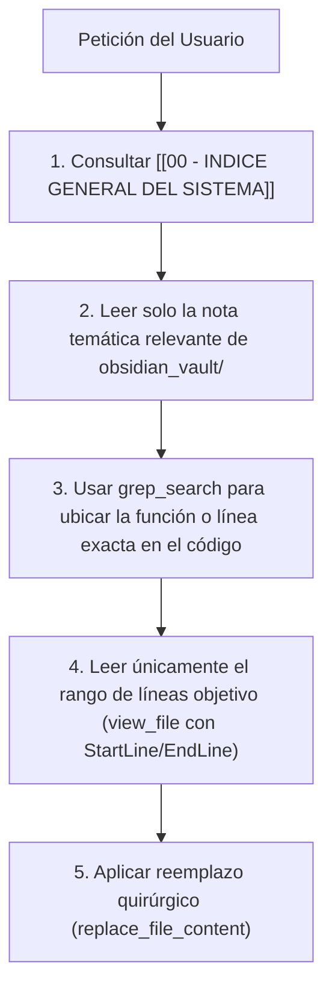

# ⚡ 09 - Protocolo de Ahorro de Tokens para LLMs

> **REGLA CRÍTICA PARA MODELOS DE IA (CLAUDE / GEMINI):**
> Este repositorio cuenta con archivos extensos (por ejemplo, `web/frontend/js/app.js` con ~2000 líneas y `web/backend/main.py` con ~400 líneas).
> **NO LEAS ESTOS ARCHIVOS COMPLETOS DE ENTRADA.** Hacerlo consume entre 30.000 y 80.000 tokens innecesariamente en cada interacción.

---

## 🎯 Protocolo de Lectura Eficiente para Asistentes de IA

Cuando el usuario pida modificar, explicar o depurar una funcionalidad, el asistente debe seguir esta secuencia estricta:

---

## 🗺️ Mapa Rápido de Ubicaciones por Tarea

| Si el usuario pide... | Consulta esta nota primero | Archivo a editar puntualmente |
| --- | --- | --- |
| Modificar el diseño o pantallas del test | [[02 - Frontend y Experiencia de Usuario]] | `web/frontend/js/app.js` (solo la función `renderX`) |
| Modificar fórmulas psicométricas o temblor | [[05 - Test d2 y Metricas Clinicas]] o [[06 - Biomarcadores Digitales y Tremor]] | `web/frontend/js/metrics.js` |
| Modificar el modelo IA o endpoints de API | [[03 - Backend y Modelos de Inteligencia Artificial]] | `web/backend/main.py` (solo el endpoint target) |
| Ajustar columnas o diseño del Excel | [[08 - Exportacion y Reportes Excel]] | `web/backend/excel_export.py` |
| Ajustar el panel de administración global | [[07 - SuperAdmin Dashboard]] | `web/backend/main.py` y `web/frontend/js/app.js` |
| Modificar la base de datos o permisos | [[04 - Base de Datos y Supabase]] | Supabase SQL / `models.py` |

---

## 🔗 Enlaces Relacionados en la Bóveda

- [[00 - INDICE GENERAL DEL SISTEMA]]
- [[01 - Arquitectura de Despliegue]]

