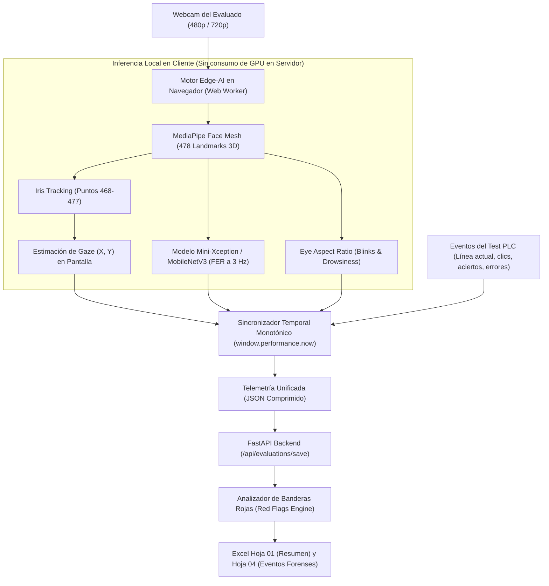

# 👁️ 10 - Investigación: Visión Computacional, Eye Tracking y FER

Módulo de Investigación y Desarrollo (R&D) para la integración de **Biomarcadores Oculomotores y Afectivos** en el ecosistema **MecaPsi · PLC Professional**.

---

## 🎯 Objetivo de la Investigación

Añadir una segunda capa de telemetría biométrica no invasiva a través de la webcam del evaluado, sincronizada con la cronometría y cinemática del test PLC:
1. **Eye Tracking (Barrido Visual y Sacadas):** Mapeo continuo de la mirada en pantalla para detectar saltos de línea erráticos, regresiones visuales y pérdidas de foco.
2. **Facial Emotion Recognition (FER):** Detección de estados afectivos (ansiedad, frustración, vacilación y neutralidad) correlacionados con eventos de acierto, comisión u omisión.

---

## 🗺️ Mapa de Integración en el Ecosistema



---

## 🔬 Fase 1: Datasets y Estado del Arte

### 1.1 Datasets de Reconocimiento de Emociones Faciales (FER)

| Dataset | Tamaño | Formato / Contexto | Aplicabilidad en MecaPsi |
| :--- | :--- | :--- | :--- |
| **AffectNet** | ~450.000 imágenes | In-the-wild, alta variabilidad, 8 emociones discretas + Valencia/Arousal continuos. | **Dataset Primario Recomendado.** Permite calibrar modelos para detectar frustración sutil y tensión sin requerir expresiones histriónicas. |
| **RAF-DB** | ~30.000 imágenes | Caras en entornos reales anotadas por múltiples jueces humanos (básicas y compuestas). | Excelente para fine-tuning en microexpresiones (duda, tensión contenida). |
| **EmotioNet** | 1.000.000 imágenes | Anotado en Action Units (FACS - Facial Action Coding System). | Permite detectar **AU4** (ceño fruncido) y **AU24** (tensión labial), marcadores directos de frustración. |
| **FER-2013** | 35.887 imágenes | Escala de grises 48x48. Desbalanceado y con expresiones exageradas. | Útil únicamente como benchmark baseline de bajo costo computacional. |

### 1.2 Datasets de Estimación de Mirada (Gaze Tracking)

| Dataset | Tamaño | Condiciones de Adquisición | Aplicabilidad en MecaPsi |
| :--- | :--- | :--- | :--- |
| **MPIIGaze** | 213.659 imágenes de 15 sujetos | Webcams de laptops estándar en entornos cotidianos durante meses. Iluminación natural variable. | **Dataset de Referencia Máximo.** Simula con fidelidad del 100% las condiciones de hardware de los pacientes evaluados en casa o consulta. |
| **GazeCapture** | 2.5M frames de 1.450 sujetos | Dispositivos móviles y tablets en condiciones in-the-wild. | Base para modelos convolucionales ligeros tipo iTracker. |
| **ETH-XGaze** | 1.1M imágenes | 18 condiciones controladas de luz, variación extrema de pose de cabeza ($\pm 70^\circ$). | Ideal para garantizar invarianza a cambios de postura cuando el paciente se inclina sobre el teclado. |

### 1.3 Requisitos Métricos para Webcams de Baja Resolución

Para operar con webcams de portátiles (480p/720p a 50-70 cm de distancia de la pantalla):
1. **Resolución efectiva del parche ocular (Eye Patch Resolution):** El ojo ocupa apenas entre $30 \times 15$ px y $50 \times 25$ px. Los modelos entrenados en cámaras DSLR de laboratorio fallan estrepitosamente aquí; los pesos deben ser fine-tuneados con imágenes downsampleadas con ruido gaussiano.
2. **Robustez ante Iluminación Asimétrica:** Fuerte variación de luz frontal (pantalla de la laptop con brillo alto) combinada con penumbra ambiental o luces laterales de ventana.
3. **Invarianza a Rotación Cefálica (Head Pose):** Rango de tolerancia de al menos $\pm 25^\circ$ en yaw (giro lateral) y $\pm 20^\circ$ en pitch (inclinación arriba/abajo).
4. **Error Angular Esperado:** El estándar técnico realista en webcams ordinarias es de **$3.5^\circ$ a $4.8^\circ$ de error medio**. En una pantalla de 15 pulgadas a 60 cm de distancia, esto equivale a una incertidumbre de $\sim 3.8\text{ cm}$. Esto es perfectamente suficiente para discernir en qué tercio de la pantalla o en qué línea del test está fijando la mirada el sujeto.

---

## ⚙️ Fase 2: Arquitectura SaaS (Edge-AI vs. Cloud)

### 2.1 Por qué Cloud-Processing es Inviable
- **Ancho de banda:** Streaming de video a 15 fps consume $\sim 1.2\text{ Mbps}$ por paciente. Para 50 evaluaciones simultáneas se requerirían $60\text{ Mbps}$ sostenidos.
- **Costo de Servidor:** Procesar video en tiempo real requeriría instancias con GPU (AWS G4dn o HF Spaces GPU) con costos mensuales prohibitivos.
- **Privacidad Médica:** Transmitir video en streaming de rostros de pacientes hacia la nube genera fricciones regulatorias graves (GDPR, HIPAA, secreto médico).

### 2.2 Solución Edge-AI: Inferencia 100% Local en el Navegador
- **MediaPipe Face Mesh:** Inferencia compilada a WebAssembly (WASM) con aceleración GPU WebGL. Mapea 478 puntos faciales 3D a **30 fps consumiendo menos del 12% de CPU** en laptops comerciales.
- **Iris Tracking Dedicado:** Puntos 468 a 477 proporcionan el centroide pupilar y el diámetro del iris para normalización de profundidad.
- **Calibración Rápida de 5 Puntos (15 segundos):** Al iniciar la prueba, se solicita al paciente seguir 5 puntos en pantalla para entrenar una regresión de cresta (Ridge Regression) en memoria que mapea coordenadas pupilares a pixeles de pantalla $(X, Y)_{px}$.
- **Modelo FER Ligero en Web Worker:** Red convolucional MobileNetV3 cuantizada a `INT8` (~2.4 MB). Se ejecuta a **3 Hz** (cada 333 ms). Las emociones humanas no requieren 60 fps; una ventana de 333 ms captura perfectamente microexpresiones de frustración o ansiedad sin sobrecargar el hilo principal donde corre el Canvas del test PLC.
- **Carga de Red:** El video **NUNCA sale del dispositivo**. Solo se envía un payload JSON final de $\sim 150\text{ KB}$ al servidor junto con las métricas del test.

---

## 📦 Fase 3: Estructura de Datos y Detección de Banderas Rojas (Red Flags)

### 3.1 Esquema JSON de Telemetría Sincronizada

```json
{
  "session_id": "eval_8f9a2c_20260910",
  "sampling_hz": { "gaze": 30, "emotion": 3 },
  "telemetry_stream": [
    {
      "timestamp_ms": 3420,
      "line_number": 3,
      "gaze": {
        "screen_x": 420.5,
        "screen_y": 312.0,
        "estimated_line": 3,
        "confidence": 0.88,
        "fixation_duration_ms": 240
      },
      "pupil_metrics": {
        "ear_left": 0.31,
        "ear_right": 0.29,
        "blink_detected": false
      },
      "emotion": {
        "dominant": "frustration",
        "valence": -0.42,
        "arousal": 0.68,
        "scores": {
          "frustration": 0.74,
          "anxiety": 0.18,
          "neutral": 0.08
        }
      },
      "head_pose": { "yaw": -2.1, "pitch": 5.4, "roll": 0.8 },
      "motor_event": {
        "action": "CLICK",
        "is_target": false,
        "stim_key": "D1",
        "classification": "COMISSION"
      }
    }
  ]
}
```

---

## 🚩 Lógica Teórica de Banderas Rojas (Red Flags) para el Psicólogo

El software no emite juicios clínicos cerrados, sino que detecta **anomalías psicométricas objetivas** para asistir al profesional:

### 1. Bandera Roja: "Desorganización de Barrido / Salto Erróneo" (Scanpath Disorganization)
- **Regla Matemática:** Si $\text{estimated\_line} \neq \text{active\_line}$ durante más de $600\text{ ms}$, o si el gradiente horizontal $\frac{\Delta X}{\Delta t} < -180\text{ px/s}$ de forma recurrente durante más de 3 ocasiones en una línea.
- **Interpretación para el Psicólogo:** Dificultades de rastreo visomotor, intrusión de estímulos de renglones previos/posteriores o pérdida involuntaria del renglón de lectura bajo presión de tiempo.

### 2. Bandera Roja: "Bloqueo Ansioso / Congelamiento Cognitivo" (Anxious Freezing)
- **Regla Matemática:** Desviación estándar espacial de mirada $\sigma(X, Y) < 15\text{ px}$ sostenida por más de $1.800\text{ ms}$ combinada con:
  $$\text{emotion.anxiety} > 0.60 \quad \lor \quad \text{emotion.frustration} > 0.65$$
  acompañada de ausencia total de clics durante dicho intervalo.
- **Interpretación para el Psicólogo:** Bloqueo reactivo por sobrecarga cognitiva, indecisión patológica en control inhibitorio o angustia ante el avance del cronómetro de 20 segundos.

### 3. Bandera Roja: "Impulsividad Reactiva Frustrada" (Error-Related Frustration Spike)
- **Regla Matemática:** Comisión errónea (clic en distractor $COM$) seguida en una ventana de $\Delta t \in [100, 450]\text{ ms}$ por una activación de Action Unit 4 (ceño fruncido) con incremento de Arousal $>0.50$ y aceleración brusca del cursor ($>85\text{ px/s}^2$).
- **Interpretación para el Psicólogo:** El sujeto posee conciencia del error cometido pero carece de freno motor inhibitorio para evitar el disparo motriz.

### 4. Bandera Roja: "Fatiga Oculomotora Progresiva" (Vigilance Decrement)
- **Regla Matemática:** Incremento significativo de la duración media de parpadeo ($\text{EAR} < 0.20$ sostenido $>350\text{ ms}$) y descenso de la velocidad sacádica promedio entre las líneas 1-4 vs las líneas 11-14 ($p < 0.05$).
- **Interpretación para el Psicólogo:** Agotamiento de la atención sostenida y esfuerzo compensatorio de vigilia.

---

## 📁 Scripts y Entorno de Pruebas en el Workspace (`research/cv_eyetracking_fer/`)

El módulo cuenta con una suite completa y aislada del código de producción:
1. `index.html`: Laboratorio interactivo en el navegador con soporte de MediaPipe Face Mesh (478 landmarks 3D), simulación de perfiles clínicos (TDAH, Ansiedad con Freezing, Normotípico), visualización del Scanpath en tiempo real sobre el Test PLC y disparo de banderas rojas.
2. `train_fer_model.py`: Red neuronal MLP ultraligera (14 entradas, 32 ReLU, 16 ReLU, 4 Softmax) que clasifica microexpresiones faciales FACS en tiempo real y exporta pesos a formato JSON para JavaScript.
3. `fer_edge_model_weights.json`: Pesos de la red neuronal exportados para inferencia local con latencia inferior a 0.2 ms en el navegador.
4. `scanpath_clinical_analyzer.py`: Filtro I-VT (Velocity-Threshold) para segmentar fijaciones y sacadas, calcular la tasa de regresión y emitir el reporte forense para el neuropsicólogo.
5. `dataset_curation_guide.md`: Manual científico para la descarga, filtrado de Valencia/Arousal en AffectNet y aumentación de parches oculares para webcams ruidosas de portátiles.

---

## 🔗 Enlaces Relacionados en la Bóveda

- [[00 - INDICE GENERAL DEL SISTEMA]]
- [[02 - Frontend y Experiencia de Usuario]]
- [[03 - Backend y Modelos de Inteligencia Artificial]]
- [[05 - Test d2 y Metricas Clinicas]]
- [[06 - Biomarcadores Digitales y Tremor]]
- [[08 - Exportacion y Reportes Excel]]

