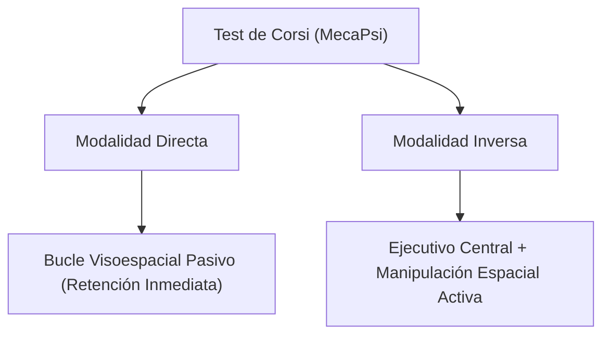

# 🧊 Test de Bloques de Corsi y Memoria de Trabajo Visoespacial (MecaPsi)

## 📌 1. Fundamento Neuropsicológico y Clínico

El **Test de Bloques de Corsi** (Corsi, 1972; Milner, 1971; Kessels et al., 2000) es la prueba de referencia para evaluar la **memoria a corto plazo visoespacial** y la **memoria de trabajo ejecutiva**.

En la plataforma **MecaPsi**, el test se digitalizó con una disposición espacial de 9 cubos 3D interactivos sobre fondo contrastado y calibrado ergonómicamente:

### Modalidades Evaluadas:
1. **Modalidad Directa:**
   El evaluado debe reproducir la secuencia de cubos iluminados en el **mismo orden** en que fueron presentados.
   * *Mecanismo cerebral:* Bucle visoespacial dependiente de cortezas parietal y occipital derechas.
2. **Modalidad Inversa:**
   El evaluado debe reproducir la secuencia en **orden inverso** (del último al primero).
   * *Mecanismo cerebral:* Memoria de trabajo activa y manipulación de representaciones espaciales en la corteza prefrontal dorsolateral (DLPFC).

---

## 🧮 2. Métricas Psicométricas y Fórmulas Exactas

| Indicador | Símbolo | Definición / Fórmula | Interpretación Clínica |
| :--- | :--- | :--- | :--- |
| **Span Visoespacial** | `corsi_span` | Máxima longitud de secuencia completada correctamente (al menos 1 ensayo). | Amplitud de memoria inmediata (Norma típica: 5 a 6 bloques en adultos). |
| **Puntaje Compuesto** | `composite_score` | $\text{Span} \times \text{Total de Ensayos Correctos}$ | Rendimiento ponderado global (equilibrio entre capacidad y consistencia). |
| **Tasa de Precisión** | `accuracy_pct` | $\frac{\text{Ensayos Correctos}}{\text{Ensayos Totales}} \times 100$ | Porcentaje global de aciertos en la administración. |
| **Tiempo de Duda Previa** | `hesitation_time_avg_ms` | $t_{\text{primer\_clic}} - t_{\text{fin\_presentacion}}$ | Latencia de vacilación previa al inicio motor; refleja planificación ejecutiva y acceso mnémico. |
| **Tiempo de Reacción Medio** | `mean_reaction_time_ms` | $\frac{\sum \Delta t_{\text{bloques}}}{N - 1}$ | Velocidad media de secuenciación psicomotora entre clics. |

---

## ⚡ 3. Fusión Mecatrónica y Paraclínica (Hardware + Software)

El Test de Corsi integra la misma telemetría paraclínica en tiempo real de MecaPsi:

1. **Cinemática del Cursor (60 Hz):**
   * Muestreo continuo de posición del mouse $\{x, y, t\}$.
   * Cálculo del micro-temblor (*jitter* motor en $\text{px/s}^2$): $\text{Jitter} = \frac{1}{M}\sum |\vec{a}_{i} - \vec{a}_{i-1}|$.
   * Detección de temblor fino asociado a ansiedad o sobreesfuerzo motor (umbral clínico basal: $<85.0 \text{ px/s}^2$).

2. **Oculometría y Pupila (MediaPipe Face Mesh):**
   * **Apertura palpebral (EAR):** Frecuencia de parpadeos por minuto y desvíos atencionales.
   * **Pupilometría Cognitiva:** Detección de dilatación transitoria del iris ($>120\%$ sobre la línea base) durante la fase de retención previa al primer clic.
   * **Picos de Sobreesfuerzo:** Conteo de picos de carga cognitiva asociados a secuencias de alta complejidad.

3. **Expresión Facial (FER):**
   * Clasificación en tiempo real de expresiones faciales y cálculo del índice de tensión psicomotora (%) y eventos de frustración ante el error.

---

## 🔒 4. Flujo de Privacidad y Deontología Clínica

* **Bloqueo Obligatorio:** Al finalizar el test, el sistema navega obligatoriamente a la pantalla de finalización protegida (`completion`).
* **Candado del Profesional:** Requiere la contraseña del psicólogo titular para desbloquear el informe, asegurando que el paciente no interprete puntajes crudos sin acompañamiento.

---

## 📊 5. Visualización de Resultados e Historial

Tanto en la pantalla de resultados post-evaluación como en el botón **"👁️ Ver Web"** del **Historial**, se despliegan:

1. **Semáforos Normativos:** Span Visoespacial tipificado (Déficit $\le 3$, Límite $= 4$, Normativo $\ge 5$) y Puntaje Compuesto.
2. **Telemetría Paraclínica (4 Paneles):** Oculometría, FER, Cinemática a 60 FPS y Pupilometría IRIS.
3. **5 Subplots de Chart.js:**
   * Curva de Progresión Visoespacial (Nivel evaluado con puntos verde de acierto y rojo de fallo).
   * Cronometría Cognitiva (Duda previa vs TR medio).
   * Distribución de Precisión (Aciertos vs Fallos).
   * Campana Normativa de Gauss (Percentil poblacional según baremos de Kessels).
   * Dinámica Motora y Micro-temblor por Ensayo.
4. **Reproductor y Descargador de Video WebM:** Si la sesión contó con cámara activa.
5. **Desglose Ensayo por Ensayo:** Tabla con secuencia presentada, secuencia del usuario y latencias en milisegundos.

---

## 📁 6. Exportación Forense en Excel (`save_excel_corsi`)

El backend compila un libro `.xlsx` de 6 hojas mediante `openpyxl`:
* `01_Resumen_Clinico`: Ficha del paciente, Span, Puntaje Compuesto y métricas paraclínicas.
* `02_Desglose_Ensayos`: Matriz ensayo a ensayo con secuencias y tiempos de reacción.
* `03_Glosario_Metricas`: Diccionario conceptual y referencias normativas.
* `04_Registro_Eventos_CRUDOS`: Trazabilidad clic por clic con coordenadas y milisegundos transcurridos.
* `05_Vectores_Graficas`: Series numéricas tabuladas para análisis en SPSS o R.
* `06_XL_Visuales`: Panel de 4 gráficos vectoriales Matplotlib incrustados.

---

## 🧠 7. Vector Estandarizado de 32 Características de Corsi

El motor `CorsiMLPredictor` extrae un vector de 32 entradas multidimensionales que integran cronometría, psicometría, baremos poblacionales y biomarcadores paraclínicos:

| Índice | Variable | Tipo / Escala | Descripción Clínica |
| :--- | :--- | :--- | :--- |
| 1 | `edad_norm` | $[0, 1]$ | $(\text{Edad} - 6) / 79$ (estratificación etaria) |
| 2 | `lateralidad` | $\{-1, 0, +1\}$ | Diestro (+1), Zurdo (-1), Ambidiestro (0) |
| 3 | `corsi_span` | $[2, 9]$ | Span máximo completado |
| 4 | `max_level` | $[2, 9]$ | Longitud máxima evaluada |
| 5 | `total_trials` | $\mathbb{N}$ | Volumen total de ensayos administrados |
| 6 | `correct_trials` | $\mathbb{N}$ | Ensayos completados con éxito |
| 7 | `error_trials` | $\mathbb{N}$ | Ensayos con falla secuencial |
| 8 | `accuracy_pct` | $[0, 100]\%$ | Tasa global de exactitud |
| 9 | `composite_score` | $\mathbb{N}$ | Block-Product Score ($\text{Span} \times \text{Aciertos}$) |
| 10 | `mean_rt_ms` | ms | Latencia media de reacción entre bloques |
| 11 | `hesitation_time_avg_ms` | ms | Tiempo medio de vacilación / duda táctica previa |
| 12 | `total_time_sec` | Segundos | Duración total acumulada del test |
| 13 | `is_reverse` | $\{0, 1\}$ | Modalidad Inversa (1) vs Directa (0) |
| 14 | `span_dev_kessels` | $\mathbb{R}$ | $\text{Span} - \text{Media Normativa Kessels}(\text{edad})$ |
| 15 | `block_product` | $\mathbb{N}$ | $\text{Span} \times \text{Aciertos}$ |
| 16 | `transposition_rate` | $[0, 100]\%$ | Porcentaje de errores de orden secuencial |
| 17 | `intrusion_rate` | $[0, 100]\%$ | Porcentaje de errores por tocar cubos ajenos |
| 18 | `euclidean_error_dist` | $\%$ Canvas | Desviación topológica media respecto al objetivo |
| 19 | `perseveration_rate` | $[0, 100]\%$ | Clics repetitivos sobre el mismo cubo erróneo |
| 20 | `first_error_level` | $[2, 9]$ | Nivel en que se produjo la primera falla |
| 21 | `first_attempt_pass_rate`| $[0, 100]\%$ | % de niveles superados en el intento 1 |
| 22 | `mean_iti_ms` | ms | Intervalo entre pulsaciones inter-bloque |
| 23 | `iti_cv` | $\%$ | Coeficiente de variación temporal del ritmo motor |
| 24 | `latency_slope` | $\text{ms}/\text{bloque}$ | Pendiente de incremento de latencia por nivel |
| 25 | `microtremor_avg` | $\text{px/s}^2$ | Jitter cinemático del cursor a 60 FPS |
| 26 | `sweep_regularity_avg`| $[0, 100]\%$ | Regularidad de avance visual y motriz |
| 27 | `pupil_dilation_avg` | Ratio $[0.8, 1.8]x$| Dilatación pupilar relativa vs línea base de reposo |
| 28 | `cognitive_load_peaks`| Conteo | Picos transitorios de sobreesfuerzo mental ($>120\%$) |
| 29 | `blink_rate_min` | Blinks/min | Frecuencia de parpadeo oculomotor |
| 30 | `fer_tension_score` | $[0, 100]\%$ | Tensión facial sostenida (AU4/AU7) |
| 31 | `fer_frustration_events`| Conteo | Microexpresiones de frustración ante el error |
| 32 | `focus_lost_count` | Conteo | Pérdidas de foco de ventana (auditoría anti-cheat) |

---

## 🔬 8. Taxonomía de los 6 Perfiles Clínicos Neuropsicológicos

El clasificador bayesiano e inferencial de Corsi (`CorsiMLPredictor`) categoriza al paciente en 6 fenotipos clínicos basados en la literatura neuropsicológica:

1. **Normativo_Tipico (Rendimiento Base Normativo):**
   * $\text{Span} \ge 5$, precisión $\ge 65\%$, vacilación táctica fisiológica ($350 - 1600\text{ ms}$).
   * Mapeo visoespacial intacto sin sesgos en transposición ni intrusión.
2. **Disociacion_Ejecutiva_Frontal (Disfunción Frontal DLPFC):**
   * Discrepancia marcada entre Span Directo e Inverso ($\ge 2$ bloques de caída).
   * Severo incremento de latencia en modalidad inversa y alta tasa de transposiciones.
3. **Deficit_Almacenamiento_Primario (Déficit Parieto-Occipital Derecho):**
   * $\text{Span} \le 3$ tanto en directo como en inverso.
   * Compromiso intrínseco del almacén pasivo; alta frecuencia de intrusiones de cubos ajenos y alta dispersión euclidiana.
4. **Fatiga_Agotamiento_Cognitivo (Fatiga Mental Progresiva):**
   * Buen desempeño en niveles 2 a 4 con degradación súbita en niveles avanzados.
   * Marcado incremento de picos pupilares ($>2$), dilatación noradrenérgica y microexpresiones de frustración facial (FER).
5. **Impulsividad_Visomotora (Falta de Freno Inhibitorio):**
   * Latencia de duda táctica previa casi inexistente ($<300\text{ ms}$).
   * Clics acelerados y erráticos, microtemblor aumentado en el cursor y alta tasa de errores evitables.
6. **Bradipsiquia_Enlentecimiento (Lentificación Cognitivo-Motora):**
   * Tiempos de reacción y vacilación marcadamente dilatados ($>1800\text{ ms}$).
   * Alta precisión mantenida a costa de un costo temporal elevado; compatible con bradipsiquia, cautela excesiva o enlentecimiento motor.

---
*Módulo Corsi MecaPsi · Diseñado para Bóveda de Conocimiento Obsidian*
