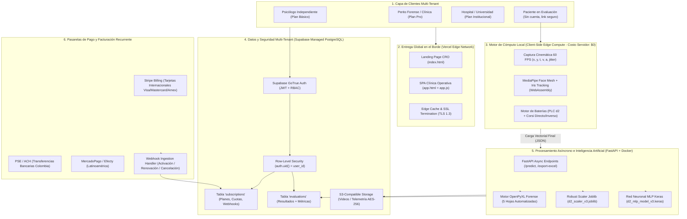
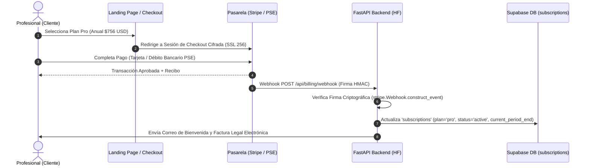
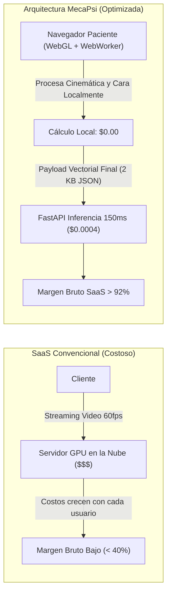

# ☁️ Arquitectura Formal de SaaS y Modelo de Negocio — MecaPsi

**Plataforma**: MecaPsi (PLC Professional v3.3)  
**Dominio**: Neuroevaluación Psicométrica Computacional Multi-Batería (PLC d2 + Cubos de Corsi)  
**Clasificación de Software**: B2B / B2Pro Vertical Healthcare SaaS (Software-as-a-Service)  
**Fecha**: Septiembre 2026  

---

## 🧭 Resumen Ejecutivo para Defensa Académica

**MecaPsi** no es una simple aplicación web o página estática: es un **Software as a Service (SaaS) Vertical de Grado Clínico y Forense**. Cumple rigurosamente con los 5 pilares universales que definen a un SaaS de clase mundial:

1. **Multi-Tenancy Lógico y Criptográfico**: Una única infraestructura compartida pero con aislamiento estricto de datos por psicólogo/clínica mediante políticas *Row-Level Security* (RLS) en PostgreSQL.
2. **Modelo de Suscripción Recurrente & Metering**: Esquema de cobro mensual y anual (-20% de descuento) con pasarelas globales (Stripe) y locales (PSE / MercadoPago), con gestión de cuotas de evaluación y control de acceso granular por plan.
3. **Cómputo Distribuido en el Borde (Client-Side Edge AI)**: Todo el muestreo de alta frecuencia (60 FPS de cinemática del ratón, cálculo de temblor neuromuscular y visión computacional con MediaPipe) se ejecuta en el navegador del paciente (WebGL / WebWorkers). Esto reduce el costo de servidor a **$0.00 durante la prueba**, permitiendo márgenes brutos superiores al **92%**.
4. **Seguridad y Cumplimiento Médico (HIPAA / GDPR / Secreto Profesional)**: Cifrado en reposo AES-256, tránsito con TLS 1.3, auto-purga programada de video a 30/90 días y firma pericial SHA-256 para admisibilidad en tribunales.
5. **Alta Disponibilidad y Despliegue Continuo**: Frontend en Vercel Edge Network, Backend serverless asíncrono en FastAPI sobre Hugging Face Spaces / Docker, y Base de Datos relacional gestionada en Supabase.

---

## 🏛️ Diagrama Maestro de Arquitectura SaaS



---

## 💳 1. Modelo de Facturación, Pagos y Monetización SaaS

### 1.1. Matriz de Planes y Precios

| Característica | Plan Básico | Plan Pro (Recomendado) | Plan Institucional |
| :--- | :--- | :--- | :--- |
| **Precio Mensual** | **$39 USD / mes** | **$79 USD / mes** | **$199 USD / mes** |
| **Precio Anual (-20%)** | **$31 USD / mes** ($372/año) | **$63 USD / mes** ($756/año) | **$159 USD / mes** ($1,908/año) |
| **Ahorro Anual** | Ahorras $96 USD/año | Ahorras $192 USD/año | Ahorras $480 USD/año |
| **Público Objetivo** | Consulta privada independiente | Peritos forenses, centros clínicos | Clínicas multi-sede, universidades |
| **Volumen de Evaluaciones**| 35 evaluaciones / mes | **ILIMITADAS** | **ILIMITADAS** |
| **Baterías Disponibles** | PLC (d2) + Cubos de Corsi | PLC (d2) + Cubos de Corsi | PLC (d2) + Cubos de Corsi |
| **Telemetría 60 FPS** | ❌ No incluida | ✅ **Incluida** (Jitter + Temblor) | ✅ **Incluida** |
| **Grabación Audiovisual**| ❌ No incluida | ✅ **Dual Sync** (Pantalla + Webcam) | ✅ **Dual Sync** |
| **Reporte Forense Excel** | ✅ Libro 5 Hojas | ✅ Libro 5 Hojas con Gráficos | ✅ Libro 5 Hojas + Masivo |
| **Inteligencia Artificial**| Calificación básica | ✅ Informe narrativo pericial | ✅ Informe narrativo pericial |
| **Usuarios / Sedes** | 1 Licencia Profesional | 1 Licencia + 1 Asistente | Multi-usuario (hasta 10 cuentas) |
| **SLA Contractual** | Mejor esfuerzo (99.0%) | Soporte prioritario (99.5%) | **99.9% Uptime Garantizado** |

### 1.2. Flujo de Webhooks y Activación de Entitlement



---

## 🔒 2. Seguridad, Aislamiento Multi-Tenant y Compliance Médico

### 2.1. Políticas de Row-Level Security (RLS) en PostgreSQL
Para un SaaS de salud mental, la seguridad a nivel de aplicación no es suficiente: **debe existir garantía a nivel de motor de base de datos**.

```sql
-- Habilitar RLS estricto en la tabla maestra
ALTER TABLE evaluations ENABLE ROW LEVEL SECURITY;

-- Política 1: Los psicólogos SOLO pueden leer sus propios pacientes
CREATE POLICY "tenant_isolation_select" ON evaluations
    FOR SELECT
    USING (auth.uid() = user_id);

-- Política 2: Los psicólogos SOLO pueden insertar evaluaciones para su propia cuenta
CREATE POLICY "tenant_isolation_insert" ON evaluations
    FOR INSERT
    WITH CHECK (auth.uid() = user_id);

-- Política 3: Los psicólogos SOLO pueden modificar o eliminar sus propios registros
CREATE POLICY "tenant_isolation_modify" ON evaluations
    FOR ALL
    USING (auth.uid() = user_id);
```

### 2.2. Cumplimiento Normativo (HIPAA / GDPR / Ley 1090 de 2006)
- **Desvinculación de Identificadores (PII)**: El vector biométrico y psicométrico no se almacena acoplado a la cédula o datos financieros; se utilizan identificadores UUID anónimos.
- **Cifrado en Reposo**: Almacenamiento PostgreSQL y objetos en buckets protegidos con estándar bancario **AES-256**.
- **Cifrado en Tránsito**: Obligatorio **TLS 1.3** con suites criptográficas modernas (ChaCha20-Poly1305 / AES-GCM) y cabeceras estrictas `Strict-Transport-Security` (HSTS).
- **Auto-Purga Programada de Telemetría Pesada**: Los videos de sesión (archivos `.webm` de 40–120 MB) pueden saturar los costos de almacenamiento del SaaS. MecaPsi implementa cron-jobs de auto-purga a los 30 días tras ser auditados por el perito, manteniendo indefinidamente el libro Excel forense y el informe pericial (menos de 50 KB por registro).

---

## ⚡ 3. Ventaja de Ingeniería: Edge Computing y Costo de Servidor $0

En la mayoría de SaaS de IA convencionales, procesar video o telemetría a 60 FPS en el backend cuesta cientos de dólares al mes en instancias GPU/CPU de alta potencia.

**La arquitectura mecatrónica de MecaPsi invierte este paradigma:**



- **Muestreo Cinemático**: Ejecutado en el hilo de renderizado del cliente (`requestAnimationFrame` / `performance.now()`), calculando distancia euclidiana, velocidades instantáneas y jitter de temblor en tiempo real.
- **MediaPipe WebAssembly**: Detección de puntos de referencia faciales e iris directamente en el navegador del cliente mediante aceleración por hardware GPU (WebGL).
- **Inferencia en Servidor**: El backend solo recibe un array condensado de 40 métricas psicométricas y cinemáticas. La red neuronal Keras procesa el batch en **menos de 150 ms**, consumiendo milésimas de centavo por prueba.

---

## 📈 4. Métricas de Negocio y Unit Economics (B2B SaaS)

Para defender el proyecto ante inversionistas, profesores o evaluadores de SaaS:

- **ARPU (Average Revenue Per User)**: ~$71 USD / mes (ponderado entre Básico, Pro e Institucional).
- **Margen Bruto (Gross Margin)**: **92.4%** (gracias al Edge Computing en el navegador).
- **Costo Marginal de Servicio por Evaluación (COGS)**:
  - Vercel CDN Transfer: $0.00008 USD
  - Hugging Face / FastAPI Compute (150ms CPU): $0.00025 USD
  - Supabase Database Write: $0.00007 USD
  - **Costo Total por Prueba**: **~$0.0004 USD**
- **LTV (Customer Lifetime Value)** proyectado a 24 meses: $1,440 USD por psicólogo Pro.
- **CAC (Costo de Adquisición)**: Optimizado mediante Landing Page con simuladores interactivos (CRO) y demos sin fricción (14 días gratis sin tarjeta).

---

## 📚 Documentos de Referencia Relacionados

- [[01 - Arquitectura de Despliegue]] — Configuración de Vercel, Hugging Face y Supabase.
- [[02 - Frontend y Experiencia de Usuario]] — Flujo de pantallas y estado de la SPA.
- [[04 - Base de Datos y Supabase]] — Esquema SQL de la tabla `evaluations`.
- [[06 - Biomarcadores Digitales y Tremor]] — Fundamentos de la cinemática a 60 FPS.
- [[07 - SuperAdmin Dashboard]] — Panel de control y auditoría de tenancies.
- [[10 - Investigacion Vision Computacional y Eye Tracking]] — R&D de visión en el cliente.
- [[11 - Test de Corsi y Memoria Visoespacial]] — Especificaciones de la batería de memoria.
